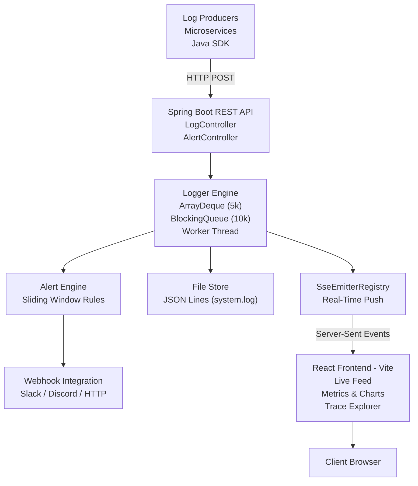

## LogStream

A distributed observability platform built with Spring Boot and React. Centralizes logs from multiple services in real-time, with structured querying, distributed tracing, live statistics, service health monitoring, and an alerting engine.

---

## 🎯 The Problem
When a distributed application fails, developers are blind. Logs are scattered across files and servers, there is no real-time visibility, and debugging means SSH-ing into machines and grepping through files after the fact.

**LogStream** solves this by providing a single pane of glass to ingest, view, query, and alert on logs from all your services—**instantly**.

---

## 🏗️ Architecture



---

## ✨ Features

- ⚡ **Real-Time Streaming:** The dashboard connects via SSE (`EventSource`). Logs are pushed the instant they arrive—no polling, no lag.
- 🔍 **Structured Query API:** Filter logs server-side by severity, service, `traceId`, regex search, or time range. In-memory O(n) scan ensures microsecond latency.
- 🔗 **Distributed Tracing:** Seamlessly links logs using `traceId` and `spanId`. The Trace Explorer renders a full timeline across every service.
- 📊 **Live Statistics:** Instantly visualizes severity distribution, top services by volume, and rate per minute.
- 🩺 **Service Health Board:** Automatically classifies each service as **Healthy**, **Degraded**, or **Silent**.
- 🚨 **Alert Engine:** Sliding-window rules trigger webhooks when anomalous patterns occur (e.g., 5 `HIGH` severity logs within 60 seconds).
- 🛡️ **Bounded & Safe:** Built-in backpressure. Non-blocking `offer()` queue prevents the API from stalling under high load.
- 💾 **JSON Lines Persistence:** Every log is cleanly appended as a single JSON object, making it `jq` compatible.
- ☕ **Java SDK:** A zero-dependency async batching client for any Java 17+ app. Buffers entries and flushes efficiently.

---

## Stack

| | |
|---|---|
| Backend | Java 17, Spring Boot 3.2.5 |
| Real-time | Server-Sent Events (`SseEmitter`) |
| Frontend | React 18, Vite |
| Charts | Recharts |
| Disk storage | JSON Lines (`logs/system.log`) |
| Tests | JUnit 5, MockMvc, Mockito |
| Container | Docker (eclipse-temurin:17-jdk-alpine) |

---

## Running Locally

**Prerequisites:** Java 17+, Maven 3.8+, Node.js 18+

```bash
# Terminal 1 — Start the Spring Boot Backend (http://localhost:8080)
mvn spring-boot:run

# Terminal 2 — Start the React Frontend (http://localhost:5173)
cd frontend
npm install
npm run dev
```

*Logs are written to `logs/system.log` (created automatically).*

### Environment Variables

| Variable | Default | Purpose |
|---|---|---|
| `PORT` | `8080` | Backend HTTP Port |
| `ALLOWED_ORIGINS` | `http://localhost:5173` | CORS allow-list for the frontend |
| `alert.webhook.url` | *(empty)* | Webhook URL for external alert delivery (e.g., Slack) |

> [!TIP]
> **Securing your Webhook URL locally:** Instead of placing your webhook URL in the main `application.properties` (which is tracked by Git), create a file named `application-secret.properties` in `src/main/resources/`. Add your URL there (`alert.webhook.url=...`). The main properties file is configured to import this secret file, and `.gitignore` ensures it never gets uploaded to your repository!

### Docker Deployment

The `Dockerfile` provides a production-ready, multi-stage build. It solves the "it works on my machine" problem by ensuring anyone can run LogStream without needing Java or Maven installed locally.

```bash
docker build -t logstream .

docker run -p 8080:8080 \
  -e ALLOWED_ORIGINS=https://your-app.com \
  -e alert.webhook.url=https://hooks.slack.com/services/xxx \
  logstream
```

---

## 🔌 API Reference

### Log Endpoints

| Method | Path | Description |
|---|---|---|
| `GET` | `/api/logs` | Fetch logs (supports query filters) |
| `POST` | `/api/logs` | Submit a single log entry |
| `POST` | `/api/logs/batch` | Submit a batch (used by SDK) |
| `DELETE` | `/api/logs` | Clear memory, queue, and disk storage |
| `GET` | `/api/logs/stats` | Fetch aggregate statistics |
| `GET` | `/api/logs/stream` | **SSE stream** (`text/event-stream`) |

### Querying Logs (`GET /api/logs`)
```text
?severity=HIGH
?service=payment-service
?traceId=abc-123
?search=NullPointer.*        # plain string or regex
?from=1714000000000          # epoch ms, inclusive
?to=1714003600000            # epoch ms, inclusive
?limit=100                   # default 500, max 500
```

### Alert Rules

| Method | Path | Description |
|---|---|---|
| `GET` | `/api/alerts/rules` | List active rules |
| `POST` | `/api/alerts/rules` | Create a rule |
| `DELETE` | `/api/alerts/rules/{id}` | Delete a rule |

**Example rule — fires if 5+ HIGH logs appear within 60 seconds:**

```json
{
  "severity": "HIGH",
  "threshold": 5,
  "windowSeconds": 60,
  "cooldownMinutes": 10
}
```

### Log schema

```json
{
  "id":          "uuid — set server-side if omitted",
  "data":        "your log message",
  "severity":    "HIGH | WARN | LOW",
  "timestamp":   "set server-side if omitted",
  "threadName":  "set server-side if omitted",
  "service":     "payment-service",
  "environment": "dev | staging | prod  (defaults to dev)",
  "traceId":     "links related logs across services",
  "spanId":      "identifies a specific operation",
  "stackTrace":  "optional stack trace string"
}
```

---

## 📦 Java SDK
Integrate the standalone Java client into your applications effortlessly:

```java
LogStreamClient client = LogStreamClient.builder("http://localhost:8080")
    .service("payment-service")
    .build();

// Simple helpers
client.info("Payment processed successfully");
client.warn("Slow response: 2400ms");
client.error("Database connection timeout", exception, traceId);

// Full control via Builder
client.log(
    LogEntry.builder("Custom audit event")
        .high()
        .service("payment-service")
        .traceId("abc-123")
        .spanId("def-456")
        .build()
);

client.close(); // Drains buffer and shuts down gracefully
```

The SDK buffers entries locally and flushes to `POST /api/logs/batch` every 500 ms or when the buffer reaches 100 entries. `close()` is safe to call in a shutdown hook.

---

## Tests

```bash
mvn test
```

17 tests, 0 failures:

| Class | Tests | What is verified |
|---|---|---|
| `AppTest` | 1 | Spring context loads |
| `LogControllerTest` | 6 | GET, POST enrichment, DELETE via MockMvc |
| `FileStoreTest` | 5 | JSON Lines write, newline injection, `clearFile()` |
| `LoggerServiceTest` | 5 | addLog, order, 5k eviction, clear, immutable snapshot |

---

## Project Structure

```
loggingSystem/
├── src/main/java/logger/
│   ├── App.java
│   ├── alert/
│   │   ├── AlertController.java      # GET/POST/DELETE /api/alerts/rules
│   │   ├── AlertEngine.java          # Sliding-window evaluator
│   │   ├── AlertRule.java
│   │   └── WebhookNotifier.java      # HTTP POST on alert fire
│   ├── config/
│   │   └── WebConfig.java            # CORS (env-configurable)
│   ├── controller/
│   │   ├── HomeController.java
│   │   └── LogController.java        # All /api/logs/* endpoints + SSE
│   ├── data/
│   │   ├── Datastore.java
│   │   └── FileStore.java            # JSON Lines writer
│   ├── enums/Severity.java
│   ├── model/
│   │   ├── LogQuery.java             # Server-side filter DTO
│   │   └── LogStats.java             # Stats response DTO
│   ├── pojo/Log.java
│   └── service/
│       ├── Logger.java               # Core engine: store + queue + lifecycle
│       ├── SseEmitterRegistry.java   # Manages active SSE connections
│       └── StatsService.java         # Compute stats from snapshot
├── frontend/src/
│   ├── App.jsx                       # Root: SSE connection + tab nav
│   ├── App.css
│   └── components/
│       ├── LiveFeed.jsx              # Log list, add form, search, filter
│       ├── StatsPanel.jsx            # Recharts: line + pie + bar
│       ├── TraceExplorer.jsx         # Trace ID timeline
│       └── ServiceHealth.jsx         # Per-service status board
├── sdk/
│   ├── pom.xml                       # Standalone Maven project
│   └── src/main/java/logger/sdk/
│       ├── LogEntry.java             # Immutable log + fluent builder
│       └── LogStreamClient.java      # Async batching HTTP client
├── logs/                             # Runtime only — git-ignored
├── Dockerfile
└── pom.xml
```

---

## Design Decisions

| Decision | Choice | Reasoning |
|---|---|---|
| Real-time transport | SSE over WebSocket | Log delivery is server → client only; SSE has no extra library, native browser reconnect, no STOMP config |
| Storage format | JSON Lines over plain text | Injection-safe (Jackson escapes control chars); readable with `jq` |
| Query layer | In-memory (max 5k) | O(5k) scan takes microseconds; avoids a database dependency |
| Backpressure | Drop (`offer()`) over block | Keeps API responsive; log data is observability, not a financial record |
| Alert engine | In-process over microservice | No Kafka or RabbitMQ needed; simple method call, zero latency |
| Shutdown | Poison-pill + 5 s drain | No log loss on `SIGTERM`; consumer finishes its queue before the JVM exits |
| SDK flush | HTTP batch over per-log HTTP | One TCP connection per 100 logs instead of per log; low overhead |
